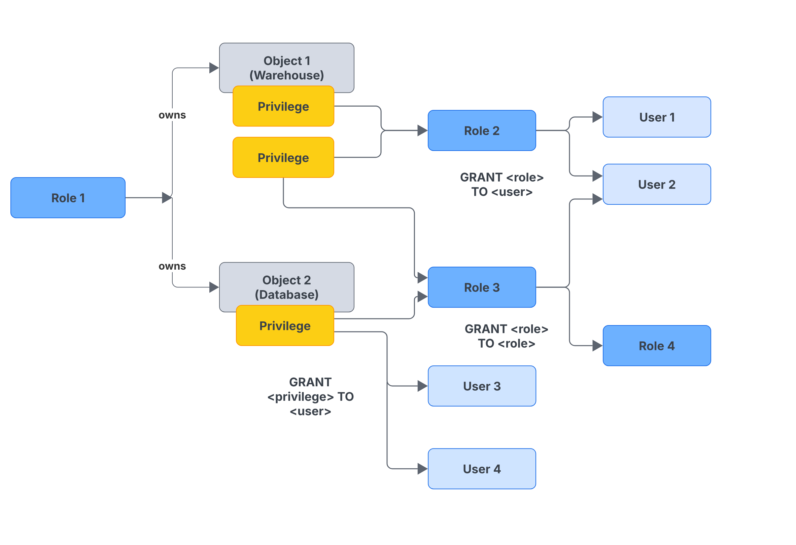

# Access Control

- To understand access control we need to understand few terms:
  - **Securable object**: An entity to which access can be granted and unless allowed by a grant, access is denied.
  - **Privilege**: A defined level of access to an object. Multiple distinct privileges may be used to control the granularity of access granted.
  - **Role**: An entity to which privileges can be granted.
  - **User**: A user identity recognized by Snowflake to which privileges can be granted.
- Roles can be assigned to users or other roles.
- There are three access control frameworks:
  - **Discretionary Access Control (DAC)**: Each object has an owner, who can in turn grant access to that object. Ex: Role 1 has the OWNERSHIP privilege on both Object 1 and Object 2 as shown in the above figure.
  - **Role-based Access Control (RBAC)**: Access privileges are assigned to roles, which are in turn assigned to users. Ex: Privileges on Object 1 can be granted to Role 2, which can then be granted to User 1 and User 2 as shown in the above figure. Usually RBAC is used to manage access to securable objects in Snowflake.
  - **User-based Access Control (UBAC)**: Access privileges are assigned directly to users. Ex: Privileges on Object 2 can be granted directly to User 3 and User 4 as shown in the above figure.
- To own an object means that a role has the OWNERSHIP privilege on the object and each securable object is owned by a single role, which by default is the role used to create the object.
- So when a new Snowflake object is created, it is not owned by the user who created it, instead the role owns the object.
- When this role is assigned to users, they effectively have shared control over the object.
- Access control considers privileges assigned directly to users only when `USE SECONDARY ROLE` is set to ALL.
- In a regular schema, the owner role has all privileges on the object by default, including the ability to grant or revoke privileges on the object to other roles and in addition, ownership can be transferred from one role to another using `GRANT OWNERSHIP` command.
- In a managed access schema, object owners lose the ability to make grant decisions. Only the schema owner (role with the OWNERSHIP privilege on the schema) or a role with the `MANAGE GRANTS` privilege can grant privileges on objects in the schema, including future grants, centralizing privilege management.
