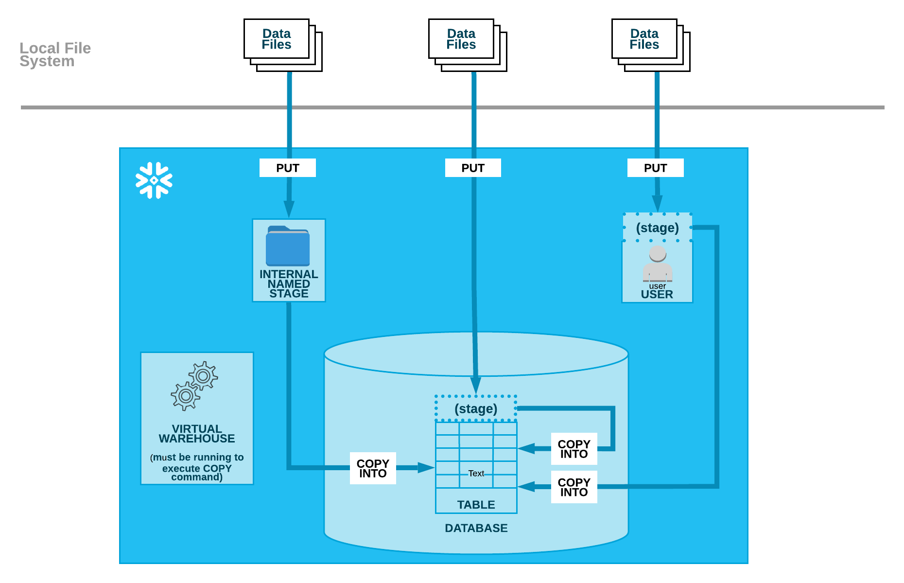

# Data Loading



- It is the process of efficiently importing data from staged (Internal or External) locations into database tables, a process that relies on a virtual warehouse being active to execute DML operations.
- Snowflake provides multiple loading solutions:
  - **Bulk Loading**: It is a way to handle batches of data, allowing for simple transformations like column reordering or column omission or type casting during the load using `COPY` command.
  - **Continuous Loading**: It is a way in which micro-batch ingestion can be performed using Snowpipe either by cloud messaging events or REST API endpoints or Snowpipe streaming.
  - Data residing in external cloud storage can be queried directly using External Tables or Apache Iceberg™ tables without being physically moved into Snowflake.
- It is recommended to validate the data before loading into the Snowflake target table using `VALIDATION_MODE` of the `COPY` command and use staging tables to manage `MERGE` statements.
- Table stage in Snowflake can be omitted from the FROM clause while loading data into a table.
- Loading very large files (e.g., 100 GB or larger) is not recommended and if the file continues to load for almost an entire day then the file loading could be aborted without any portion of the file being committed.
- Split larger files into a greater number of smaller files to distribute the load among the compute resources in an active warehouse.
- The number of load operations that run in parallel cannot exceed the number of data files to be loaded.
- To optimize the number of parallel operations for a load, it is recommended for aiming to produce data files roughly 100-250 MB (or larger) in size compressed.
- The number of data files that can be processed in parallel is determined by the amount of compute resources in a warehouse.
- It is recommended to dedicate separate warehouses for loading and querying operations to optimize performance for each.
- UTF-8 is the default character set when loading CSV files.
- Fields that contain delimiter characters should be enclosed in quotes (single or double) and if the data contains single or double quotes, then those quotes must be escaped.
- The number of columns in each row should be consistent.
- Avoid embedded characters, such as commas for Numeric data types (Example: 123,456).
- The fastest way to bulk load data files from a stage is to specify a list of specific files to load and hence it is recommended to partition the data into logical paths that include identifying details such as geographical location or other source identifiers, along with the date when the data was written.
- This allows the execution of concurrent `COPY` statements that match a subset of files, taking advantage of parallel operations.
- Files that were loaded successfully can be deleted from the stage during a load by specifying PURGE in the `COPY` command and after the load completes, use the `REMOVE` command to remove the files in the stage.
- To check if the data has been loaded successfully, use STATUS column of the `COPY_HISTORY` command. It shows the status of partial data loads and loading errors if any.
- To view the status of loaded files, use the `LOAD_HISTORY` command.
- The `VALIDATE` function can be used to validate the files that have been loaded earlier using the `COPY` command and returns errors encountered during the execution.
- Snowflake supports creating named file formats (default - CSV), which are database objects that encapsulate all of the required format information. They are optional, but are recommended when loading.
- If the file format options or copy options are specified in multiple locations, the load operation applies the options in the following order of precedence:
  - `COPY INTO TABLE` statement
  - Stage definition
  - Table definition
- Delimited files (CSV, TSV, etc.) are the file formats supported for loading structured data.
- JSON, Avro, ORC, Parquet, and XML are the file formats supported for loading semi-structured data.
- Snowflake recommends storing semi-structured data in a VARIANT column and it has a compressed size limit of 16 MB.
- To upload a JSON file larger than 16 MB, the `STRIP_OUTER_ARRAY` function can be used in the `FILE_FORMAT` as it removes the outer array structure and loads the records into separate table rows.
- Snowflake supports two types of NULL values in semi-structured data:
  - **JSON null (VARIANT NULL)**: It means that the value is stored as a string containing the word "null".
  - **SQL NULL**: It means the value is missing or unknown.
- `STRIP_NULL_VALUE` can convert a JSON null value to a SQL NULL value.
- When the input data contains valid JSON information in a string then `PARSE_JSON` function can be used to convert it to a VARIANT value.
  - `PARSE_JSON(null)` outputs SQL NULL
  - `PARSE_JSON('')` outputs SQL NULL
  - `PARSE_JSON('null')` outputs JSON null

## COPY INTO \<table>

- This command loads data from files present in the stage to an existing table where the columns can be reordered or omitted.
- It has built-in data loading protection that prevents duplicate loading of the same files by default.
- The bulk data load history that is available upon completion of this command is stored in the metadata of the target table for 64 days.
- The following are some optional parameters to consider while writing a `COPY` statement:
  - **`PATTERN = 'regex_pattern'`**: A regular expression pattern string, enclosed in single quotes, specifying the file names and/or paths to match. For the best performance, try to avoid applying patterns that filter on a large number of files.
  - **`FORCE = TRUE | FALSE`**: Boolean that specifies to load all files, regardless of whether they were loaded previously and haven't changed after they were loaded. This option reloads files, potentially duplicating data in a table.
  - **`PURGE = TRUE | FALSE`**: Boolean that specifies whether to remove the data files from the stage automatically after the data is loaded successfully.
  - **`VALIDATION_MODE = RETURN_<n>_ROWS | RETURN_ERRORS | RETURN_ALL_ERRORS`**: A string (constant) that instructs the command to validate the data files instead of loading them into the specified table. It does not support statements that transform data during a load and will return an error.
    - **RETURN\_\<n>\_ROWS**: Validates the specified number of rows, if no errors are encountered; otherwise, fails at the first error encountered in the rows.
    - **RETURN_ERRORS**: Returns all errors (parsing, conversion, etc.) across all files specified in the statement.
    - **RETURN_ALL_ERRORS**: Returns all errors across all files specified in the statement, including files with errors that were partially loaded during an earlier load because the `ON_ERROR` option was set to CONTINUE during the load.
  - **`STRIP_NULL_VALUES = TRUE | FALSE`**: Boolean that instructs the JSON parser to remove object fields or array elements containing null values.

## Example:

```SQL
-- Table Stage
COPY INTO mytable;

-- User Stage
COPY INTO mytable FROM @~/staged;

-- Named Internal Stage
COPY INTO mytable FROM @my_int_stage;

-- External Stage
COPY INTO mytable FROM 's3://mybucket/./../a.csv';
```
