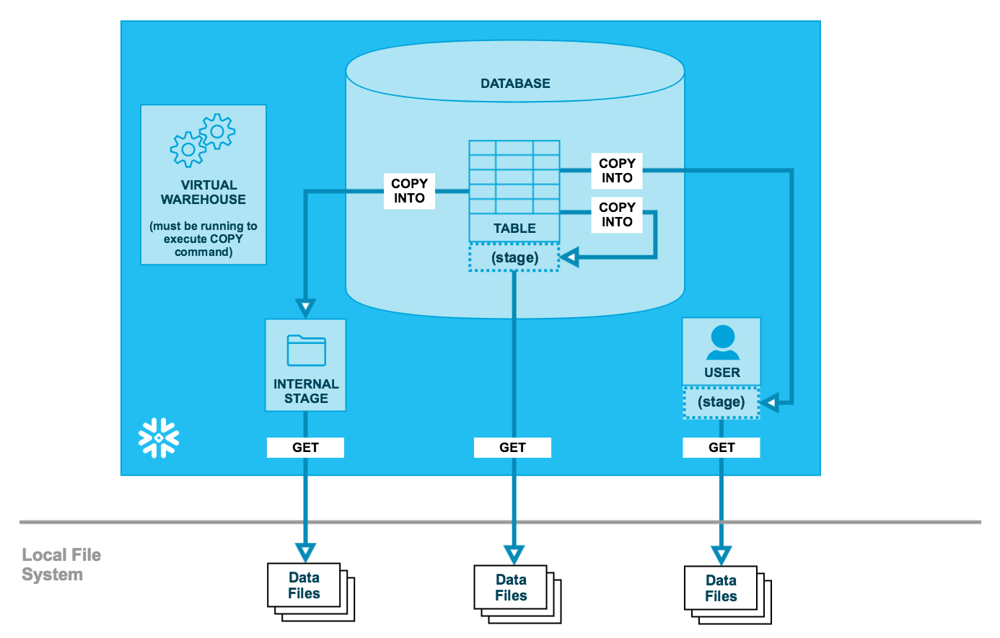

# Data Unloading



- It is the process of unloading data to stages from a database table into flat, delimited text files using `COPY` command which requires a running virtual warehouse.
- Unloading the data directly from Snowflake to the cloud storage location such as AWS is the recommended approach although permissions on an S3 bucket such as `s3:DeleteObject` and `s3:PutObject` are required.
- Snowflake supports specifying a `SELECT` statement instead of a table in the `COPY` command.
- The `COPY` command provides an option `SINGLE` for unloading data into a single file having a maximum file size of 5 GB.
- By default it loads multiple files and Snowflake assigns each file a unique name prefixed with data\_ if not specified and suffixed to ensure each file name is unique across parallel execution threads.
- When unloading data into multiple files, each file has a default file size of 16 MB.
- The maximum size for each file can be set using the `MAX_FILE_SIZE` option.
- The unload operation using `PARTITION BY` option partitions table rows into separate files unloaded to the specified stage which will increase storage efficiency by automatically compressing data based on access patterns.
- Named file formats are optional, but are recommended when you plan to regularly unload similarly formatted data and they can be specified in the `COPY` statement.
- Delimited files (CSV, TSV, etc.), JSON, and Parquet are the file formats supported for unloading data.
- When unloading to JSON files, Snowflake outputs to the NDJSON (newline delimited JSON) standard format.
- By default, all unloaded data files are encrypted and compressed using gzip, unless compression is explicitly disabled or other supported compression methods are specified.
- The `OBJECT_CONSTRUCT` function is used to convert relational data to semi-structured data and when combined with the `COPY` command can be used to convert the rows in a relational table to a single VARIANT column and unload the rows into a file.
- `TO_JSON` function converts a VARIANT value to a string containing the JSON representation of the value. `TO_JSON` and `PARSE_JSON` are (almost) converse or reciprocal functions.
- You can unload data in a relational table to a multi-column Parquet file by using a `SELECT` statement as input to the `COPY` statement.
- When unloading data to an external stage, LZO compression format can be used for Parquet files with the `COPY` command.
- Snowflake automatically uses JSON representation when numeric precision exceeds supported ranges.
- When floating-point number columns are unloaded to CSV or JSON files, Snowflake truncates the values to approximately (15,9) but they are not truncated when unloading to Parquet files, instead they are unloaded as DOUBLE columns.

## COPY INTO \<location>

- It unloads data from a table (or query) into one or more files in the stages.
- The following are some optional parameters to consider while writing a `COPY` statement:
  - **`VALIDATION_MODE = RETURN_ROWS`**: A String (constant) that instructs the command to return the results of the query in the SQL statement instead of unloading the results to the specified cloud storage location.
    - **RETURN_ROWS**: The only supported validation option that returns all rows produced by the query.
  - **`FILE_EXTENSION = '<string>' | NONE`**: A string that specifies the extension for files unloaded to a stage.
  - **`FIELD_OPTIONALLY_ENCLOSED_BY = 'character' | NONE`**: A character used to enclose strings usually single quote character ('), or double quote character ("). When a field in the source table contains this character, Snowflake escapes it using the same character for unloading.
  - **`NULL_IF = ( 'string1' [ , 'string2' ... ] )`**: A string which converts SQL NULL values to the first value in the list.
  - **`EMPTY_FIELD_AS_NULL = TRUE | FALSE`**: Boolean that is used in combination with `FIELD_OPTIONALLY_ENCLOSED_BY`. It specifies to unload empty strings in tables to empty string values without quotes enclosing the field values when set to FALSE.
  - **`SINGLE = TRUE | FALSE`**: Boolean that specifies whether to generate a single file or multiple files.

## Example:

```SQL
-- Table Stage
COPY INTO @%my_tab_stage FROM mytable;

-- User Stage
COPY INTO @~ FROM mytable;

-- Named Internal Stage
COPY INTO @my_int_stage FROM mytable;

-- External Stage
COPY INTO 's3://mybucket/./../a.csv' FROM mytable;
```
