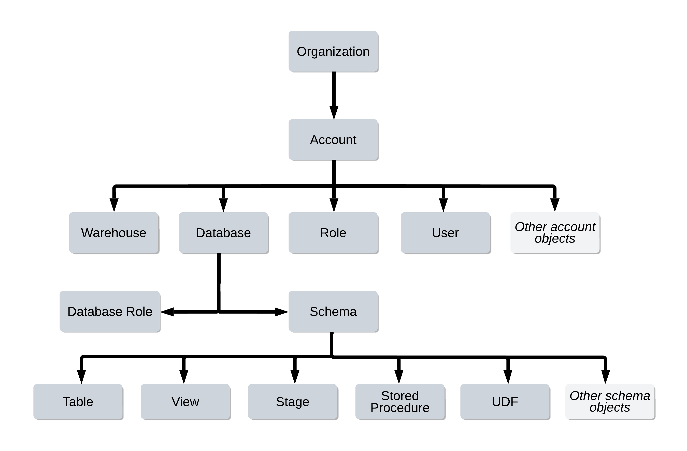

# Object Hierarchy

- The top-most container is the customer organization.
- Securable objects such as tables, views, functions, and stages are contained in a schema object, which are in turn contained in a database.
- All databases for your Snowflake account are contained in the account object.
