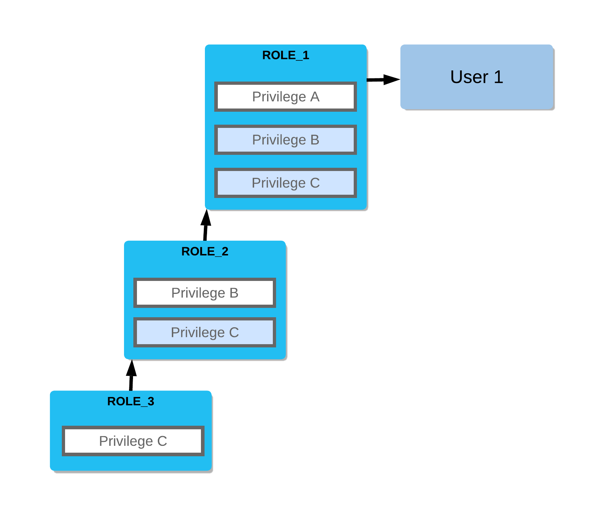

# Privileges



- Access control privileges determine who can access and perform operations on specific objects in Snowflake.
- For each securable object, there is a set of privileges that can be granted on it and for existing objects, privileges must be granted on individual objects.
- To simplify grant management, future grants allow defining an initial set of privileges on objects created in a schema.
- In a regular schema, the owner role has all privileges on the object by default, including the ability to grant or revoke privileges on the object to other roles and in addition, ownership can be transferred from one role to another using `GRANT OWNERSHIP` command.
- In a managed access schema, object owners lose the ability to make grant decisions. Only the schema owner (role with the OWNERSHIP privilege on the schema) or a role with the `MANAGE GRANTS` privilege can grant privileges on objects in the schema, including future grants, centralizing privilege management.
- A Database role is essentially the same as traditional role created at the account level that permits actions on objects within a database.
- `CREATE DATABASE`, and `CREATE SHARE` privileges are required to control access to the objects that are in a share.
- Instead of granting these privileges on objects, if the database role is granted to a share then it has more control over object-level access for different user groups.
- To access database objects, in addition to their privileges, users must be granted the USAGE privilege on the container database and schema. Ex: Assume mytable is created in mydb.myschema. In order to query mytable, a user must have USAGE privilege in mydb, USAGE privilege on myschema, and SELECT privilege in mytable, and they should be granted in a sequence `mydb -> myschema -> mytable`. Same sequence should be followed by the provider in a share.
- A cloned object is considered a new object in Snowflake so any privileges granted on the source object do not transfer to the cloned object.
- However, a cloned container object like a database or schema retains any privileges granted on the objects contained in the source object.
- When a database is cloned it replicates all granted privileges on the corresponding child objects except OWNERSHIP.

## Example:

Let us continue the [example](Roles.md#example) from Roles. Assume that the virtual warehouse is named ANALYST_WH, database is named HR_DB, schema is named ANALYTICS, and the table is named EMPLOYEES. You need to work on the EMPLOYEES table. Following commands can be executed by the Snowflake User Administrator:

- **Grant usage privileges**: The following commands in sequence is used to assign USAGE privilege to a role.

  ```SQL
  GRANT USAGE
  ON WAREHOUSE analyst_wh
  TO ROLE hr_analyst;

  GRANT USAGE
  ON DATABASE hr_db
  TO ROLE hr_analyst;

  GRANT USAGE
  ON SCHEMA hr_db.analytics
  TO ROLE hr_analyst;

  GRANT SELECT
  ON TABLE hr_db.analytics.employees
  TO ROLE hr_analyst;
  ```

- **View granted privileges**: The following sequence of commands lists all access control privileges that have been explicitly granted to roles, users, and schemas.

  ```SQL
  SHOW GRANTS
  TO ROLE hr_analyst;

  SHOW GRANTS
  TO USER vineeth;

  SHOW GRANTS
  ON SCHEMA hr_db.analytics;
  ```

- **Grant access to all tables**: The following command is used to assign SELECT privilege for all tables to a role.

  ```SQL
  GRANT SELECT
  ON ALL TABLES
  IN SCHEMA hr_db.analytics
  TO ROLE hr_analyst;
  ```

- **Grant access to future tables**: The following command is used to assign SELECT privilege for future tables to a role.

  ```SQL
  GRANT SELECT
  ON FUTURE TABLES
  IN SCHEMA hr_db.analytics
  TO ROLE hr_analyst;
  ```

- **Revoke privilege**: The following command is used to revoke access privilege on a table.

  ```SQL
  REVOKE SELECT
  ON TABLE hr_db.analytics.employees
  FROM ROLE hr_analyst;
  ```
