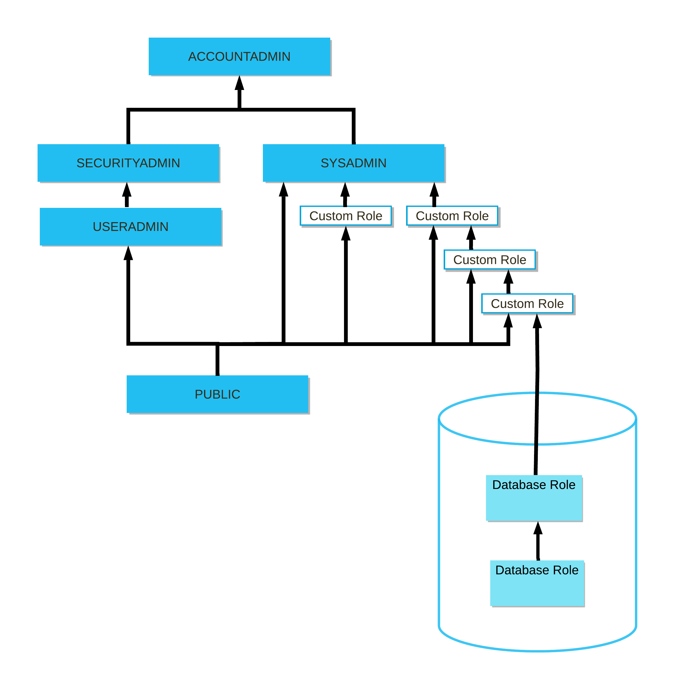

# Roles

- They are the entities to which privileges on securable objects can be granted or revoked and a user can be assigned to multiple roles.
- Roles can be also granted to other roles, creating a hierarchy of roles.
- The privileges associated with a role are inherited by any roles above that role in the hierarchy. Ex: SECURITYADMIN role inherits the privileges of the USERADMIN role.

## System-defined Roles


They are the roles that cannot be dropped and the privileges cannot be revoked. Following are the system-defined roles that are provided by Snowflake:

### ORGADMIN

- Role that uses a regular account to manage operations at the organization level such as usage information for all accounts.
- It can be granted for a user to create and manage accounts.
- `SHOW ORGANIZATION ACCOUNTS` command lists the organization account of the organization and `SHOW ACCOUNTS` command lists all accounts in the organization.
- It can rename an account and specify whether the original URL can be used to access the renamed account.
- The `SYSTEM$GLOBAL_ACCOUNT_SET_PARAMETER` function enables client redirect, account and database replication by setting `ENABLE_ACCOUNT_DATABASE_REPLICATION` to TRUE and failover features for a specified account in an organization which can only be called by administrators having this role.
- This role is not included in the hierarchy of system roles.

### ACCOUNTADMIN

- It is the top-level role in the system and should be granted only to a limited/controlled number (atleast 2) of users in your account.
- This role can `SHOW`, `DESCRIBE`, `ALTER`, or `DROP` a user.
- This role can only view the table-level storage utilization information from the `TABLE_STORAGE_METRICS` view.
- This role is required to create and manage data shares by default.
- Partner Connect is limited to administrators who have this role and a verified email address in Snowflake.
- `CREATE RESOURCE MONITOR` command can only be executed by administrators having this role.
- This role can make grant decisions to objects within a managed access schema.
- To enable MFA token caching, this role can set `ALLOW_CLIENT_MFA_CACHING` parameter to TRUE.

### SECURITYADMIN

- Role that can manage any object grant globally, as well as create, monitor, and manage users and roles.
- It is granted the `MANAGE GRANTS` security privilege to be able to modify any grant, including revoking it.
- It cannot create objects yet as it does not have the privileges needed to create the object.
- It can make grant decisions to objects within a managed access schema.
- Only administrators with this role or higher or a role with the `CREATE NETWORK POLICY` privilege can create network policies.

### USERADMIN

- Role dedicated to create and manage users and roles that it owns.
- It is granted the `CREATE USER` and `CREATE ROLE` security privileges.
- It separates the management of users and roles from the management of all grants.

### SYSADMIN

- Role that has privileges to create warehouses, databases, tables, views, and other objects in an account.
- When creating a custom role, it is a best practice to immediately grant to this role.
- When creating a hierarchy of custom roles, the top-most custom role should be assigned to this role.
- It also has the ability to grant privileges on warehouses, databases, and other objects to other roles.

### PUBLIC

- Pseudo-role that is automatically granted to every user and every role in your account.
- It can own securable objects, just like any other role but the objects owned by the role are by definition available to every other user and role.
- This role is typically used in cases where explicit access control is not needed and all users are viewed as equal with regard to their access rights.

## Custom Roles

- These can be created using the USERADMIN role or a higher role as well as by any role to which the `CREATE ROLE` privilege has been granted.
- By default, a newly-created role is not assigned to any user, nor granted to any other role.

### Example:

Consider a scenario where you got your first job as a data analyst and you are assigned to a Snowflake project. You need to work on HR employee data. Following sequence commands are executed by the Snowflake User Administrator:

- **Create custom role**: The following command is used to create a new role in the system.
  ```SQL
  CREATE ROLE hr_analyst;
  ```
- **Create user**: The following command is used to create a new user and that user should change password once logged in.

  ```SQL
  CREATE USER vineeth
  PASSWORD = 'temp_password123'
  MUST_CHANGE_PASSWORD = TRUE;
  ```

- **Grant role**: The following command is used to assign a role to a user or another role.
  ```SQL
  GRANT ROLE hr_analyst
  TO USER vineeth;
  ```
- **View roles**: The following command is used to view all the roles that exist in the system.
  ```SQL
  SHOW ROLES;
  ```
- **Revoke role**: The following command is used to remove a role from another role or a user.

  ```SQL
  REVOKE ROLE hr_analyst
  FROM USER vineeth;
  ```
