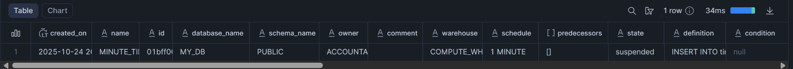
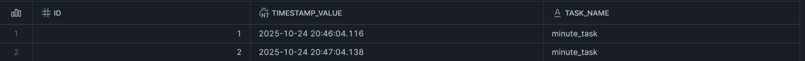
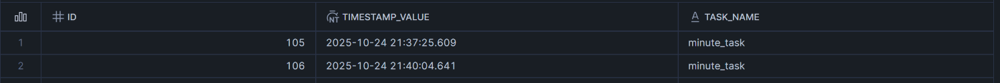
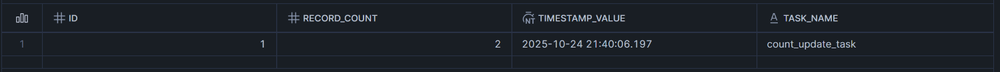

# Tasks

- They are Snowflake objects used to automate data processing and optimize business procedures within a data pipeline by running specific SQL commands or stored procedures on a predefined schedule (series of transformation steps) or triggered by an event.
- They require compute resources, either managed by the user via a virtual warehouse or automatically predicted and assigned by Snowflake using the serverless tasks model.
- The Maximum size for a serverless task run is equivalent to 2X-Large virtual warehouse.
- You can create tasks using SQL, JavaScript, Python, Java, Scala, or Snowflake Scripting.
- Tasks are initially suspended upon creation.

## Example:

Let us say you want to create a task that populates a table `timestamp_log` with timestamps every minute using a stored procedure. Follow the series of commands to get a fair idea about tasks.

- **Table Creation**: The id column that you see below automatically increments its numerical value by 1 with every new row inserted, starting from 1.
  ```SQL
  CREATE OR REPLACE TABLE timestamp_log (
  	id NUMBER AUTOINCREMENT,
  	timestamp_value TIMESTAMP_NTZ DEFAULT CURRENT_TIMESTAMP(),
  	task_name STRING
  );
  ```
- **Stored Procedure Creation**: The stored procedure that you see below inserts a new row into the `timestamp_log` table, explicitly setting the task_name column to 'minute_task'.
  ```SQL
  CREATE OR REPLACE PROCEDURE populate_timestamp_table()
  RETURNS STRING
  LANGUAGE SQL
  AS $$
  BEGIN
  	INSERT INTO timestamp_log (task_name)
  	VALUES ('minute_task');
  	RETURN 'Success';
  END;
  $$;
  ```
- **Task Creation**: The scheduled task that you see below is automatically executed every minute using the designated compute resources of COMPUTE_WH.
  ```SQL
  CREATE OR REPLACE TASK minute_timestamp_task
  WAREHOUSE = COMPUTE_WH
  SCHEDULE = '1 MINUTE'
  AS
  CALL populate_timestamp_table();
  ```
- **View Task Information**: The task when created will initially be in suspended state and you can verify it using the below command.
  ```SQL
  SHOW TASKS;
  ```
  **Output**:
  
- **Resume the Task**: Use the following command to resume the task.
  ```SQL
  ALTER TASK minute_timestamp_task RESUME;
  ```
  **Output**:
  
- **Suspend the Task**: Use the following command to suspend the task.
  ```SQL
  ALTER TASK minute_timestamp_task SUSPEND;
  ```
- **View Tasks History**: Use the following command to retrieve the execution history and status of all tasks.
  ```SQL
  SELECT *
  FROM TABLE(INFORMATION_SCHEMA.TASK_HISTORY());
  ```

# Task Graphs

- In Snowflake, you can manage multiple tasks with a task graph, also known as a directed acyclic graph (DAG).
- A task graph is composed of a root task and dependent child tasks.
- The dependencies must run in a start-to-finish direction, with no loops.
- An optional final task, called a finalizer, can perform cleanup operations after all other tasks are complete.
- You can create task graphs using SQL, JavaScript, Python, Java, Scala, or Snowflake Scripting.
- A task graph is limited to a maximum of 1000 tasks.
- A single task can have a maximum of 100 parent tasks and 100 child tasks.

## Example:

Continuing the Tasks Example above, let us say you want to create another task that populates a table `record_count_log` which updates the record count after each insertion in the `timestamp_log` table. Follow the series of commands to get a fair idea about task graphs.

- **Table Creation**: The id column that you see below automatically increments its numerical value by 1 with every new row inserted, starting from 1.
  ```SQL
  CREATE OR REPLACE TABLE record_count_log (
    id NUMBER AUTOINCREMENT,
    record_count NUMBER,
    timestamp_value TIMESTAMP_NTZ DEFAULT CURRENT_TIMESTAMP(),
    task_name STRING
  );
  ```
- **Stored Procedure Creation**: The stored procedure that you see below updates the `record_count_log` table, explicitly setting the task_name column to 'count_update_task'.

  ```SQL
  CREATE OR REPLACE PROCEDURE update_record_count()
  RETURNS STRING
  LANGUAGE SQL
  AS $$
  BEGIN
    INSERT INTO record_count_log (record_count, task_name)
    SELECT COUNT(*), 'count_update_task'
    FROM timestamp_log;

    RETURN 'Count updated successfully';
  END;
  $$;
  ```

- **Task Creation**: The scheduled task that you see below is automatically executed after minute_timestamp_task is executed. Also, observe that the predecessors column of the SHOW TASKS command output is updated for count_update_task.
  ```SQL
  CREATE OR REPLACE TASK count_update_task
  WAREHOUSE = COMPUTE_WH
  AFTER minute_timestamp_task
  AS
  CALL update_record_count();
  ```
- **Resume the Tasks**: Use the following commands to resume the tasks. First you have to resume the child task and then the parent task.
  ```SQL
  ALTER TASK count_update_task RESUME;
  ALTER TASK minute_timestamp_task RESUME;
  ```
  **Outputs**:
  
  
  To recursively resume all dependent tasks tied to a root task in a task graph, query the `SYSTEM$TASK_DEPENDENTS_ENABLE` function rather than enabling each task individually.
- **View Task Graph Status**: To view the status of a graph run that is currently scheduled or is executing, use the following command.
  ```SQL
  SELECT *
  FROM TABLE(INFORMATION_SCHEMA.CURRENT_TASK_GRAPHS());
  ```
- **View Complete Graph Status**: To view the details for runs that executed successfully, failed, or were cancelled in the past 60 minutes, use the following command.
  ```SQL
  SELECT *
  FROM TABLE(INFORMATION_SCHEMA.COMPLETE_TASK_GRAPHS());
  ```
- **View Task Dependents**: To view the list of child tasks for a given root task in a task graph, use the following command.
  ```SQL
  SELECT *
  FROM TABLE(INFORMATION_SCHEMA.TASK_DEPENDENTS(task_name => 'my_db.public.minute_timestamp_task'));
  ```
